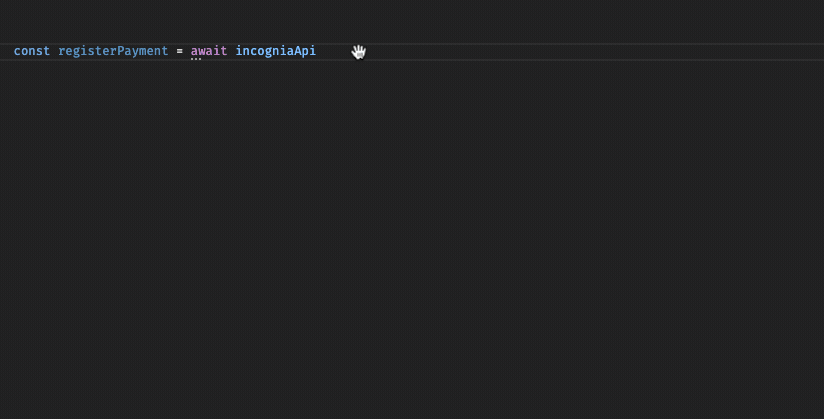

# Incognia Node Library

The official Node.js library for integrating with the Incognia API.

Documentation can be found at <https://developer.incognia.com/docs>

## Installation

npm:

```sh
npm install @incognia/api
```

yarn:

```sh
yarn add @incognia/api
```

## Getting started

Require the package:

CommonJS modules:

```js
const { IncogniaApi } = require('@incognia/api')
```

Or ES modules:

```js
import { IncogniaApi } from '@incognia/api'
```

Initialize the `IncogniaApi` with your `clientId` and `clientSecret`. This is a required step and must be done before calling any of the API methods.

```js
IncogniaApi.init({
  clientId: 'clientId',
  clientSecret: 'clientSecret'
})
```

## API methods

### Registering a Mobile Signup

This method registers a new mobile signup for the given request token and address, returning a signup assessment, containing the risk assessment and supporting evidence:

```js
try {
  const signup = await IncogniaApi.registerSignup({
    requestToken: 'request_token',
    policyId: 'policy_id',
    structuredAddress: {
      locale: 'en-US',
      countryName: 'United States of America',
      countryCode: 'US',
      state: 'NY',
      city: 'New York City',
      borough: 'Manhattan',
      neighborhood: 'Midtown',
      street: 'W 34th St.',
      number: '20',
      complements: 'Floor 2',
      postalCode: '10001'
    }
  })
} catch (error) {
  console.log(error.message)
}
```

### Registering a Web Signup

This method registers a new web signup for the given request token, returning a signup assessment, containing the risk assessment and supporting evidence:

```js
try {
  const signup = await IncogniaApi.registerWebSignup({
    requestToken: 'request_token',
    policyId: 'policy_id'
  })
} catch (error) {
  console.log(error.message)
}
```

### Registering a Mobile Login

This method registers a new mobile login for the given request token and account, returning a transaction assessment, containing the risk assessment and supporting evidence.

```js
try {
  const login = await IncogniaApi.registerLogin({
    requestToken: 'request_token',
    accountId: 'account_id',
    policyId: 'policy_id',
    externalId: 'external_id' // optional field
  })
} catch (error) {
  console.log(error.message)
}
```

### Registering a Web Login

This method registers a new web login for the given request token and account, returning a transaction assessment, containing the risk assessment and supporting evidence.

```js
try {
  const login = await IncogniaApi.registerWebLogin({
    requestToken: 'request_token',
    accountId: 'account_id',
    policyId: 'policy_id'
  })
} catch (error) {
  console.log(error.message)
}
```

### Registering a Payment

This method registers a new payment for the given request token and account, returning a transaction assessment, containing the risk assessment and supporting evidence.

```js
try {
  const payment = await IncogniaApi.registerPayment({
    requestToken: 'request_token',
    accountId: 'account_id',
    policyId: 'policy_id',
    addresses: [
      {
        structuredAddress: {
          locale: 'en-US',
          countryName: 'United States of America',
          countryCode: 'US',
          state: 'NY',
          city: 'New York City',
          borough: 'Manhattan',
          neighborhood: 'Midtown',
          street: 'W 34th St.',
          number: '20',
          complements: 'Floor 2',
          postalCode: '10001'
        },
        addressCoordinates: {
          lat: 40.74836007062138,
          lng: -73.98509720487937
        },
        type: 'shipping'
      }
    ]
  })
} catch (error) {
  console.log(error.message)
}
```

### Registering a Web Payment

This method registers a new web payment for the given request token and account, returning a transaction assessment, containing the risk assessment and supporting evidence.

```js
try {
  const payment = await IncogniaApi.registerWebPayment({
    requestToken: 'request_token',
    accountId: 'account_id',
    policyId: 'policy_id'
  })
} catch (error) {
  console.log(error.message)
}
```

### Sending Feedback

This method registers a feedback event for the given identifiers related to a signup, login or payment.

```js
try {
  IncogniaApi.registerFeedback({
    installationId: 'installation_id',
    accountId: 'account_id',
    event: FeedbackEvent.AccountTakeover,
    occurredAt: '2024-07-22T15:20:00Z'
  })
} catch (error) {
  console.log(error.message)
}
```

## Typescript enabled

Thanks to Typescript, all methods attributes and data response are typed, meaning any typescript-enabled editor can take advantage of intellisense and auto-complete:



## Response format

Responses have JSONs identical to the original api <https://us.incognia.com>, **however** property names will be in camelCase rather than snake_case, including property names in nested objects.

```json
{
  "id": "5e76a7ca-577c-4f47-a752-9e1e0cee9e49",
  "riskAssessment": "low_risk",
  "evidence": {
    "deviceModel": "Moto Z2 Play"
  }
}
```

## Exception handling

Every method call can throw `IncogniaApiError` and `IncogniaError`.

`IncogniaApiError` is thrown when the API returned an unexpected http status code. You can retrieve it by calling the `statusCode` property, along with the `payload` property, which returns the API response payload that might include additional details.

`IncogniaError` represents unknown errors, like serialization/deserialization errors.

```js
const { IncogniaApi, IncogniaApiError } = require('@incognia/api')

try {
  const loginAssessment = await IncogniaApi.registerLogin({
    requestToken: 'request_token',
    accountId: 'account_id'
  })
} catch (error) {
  if (error instanceof IncogniaApiError) {
    console.log(error.statusCode)
    console.log(error.payload)
  }
}
```

## Migration to v6

The v6 changed the `IncogniaApi` interface, transforming the previous instance methods into static methods.

When migrating to v6, adjust the `IncogniaApi` usage as follows.

### Initialization

Instead of creating an instance of the `IncogniaApi` class using your API credentials, just initialize the `IncogniaApi` with your credentials using the `init()` method. Initializing the `IncogniaApi` is a required step and must be done before calling any of the other `IncogniaApi` methods.

```js
// Before
const incogniaApi = new IncogniaApi({
  clientId: 'clientId',
  clientSecret: 'clientSecret'
})

// After
IncogniaApi.init({
  clientId: 'clientId',
  clientSecret: 'clientSecret'
})
```

### Register methods

Every method of the `IncogniaApi` instance is now static, and should be called on the `IncogniaApi` class.

```js
// Before
const signup = await incogniaApi.registerSignup({...})
const login = await incogniaApi.registerLogin({...})
const payment = await incogniaApi.registerPayment({...})
incogniaApi.registerFeedback({...})

// After
const signup = await IncogniaApi.registerSignup({...})
const login = await IncogniaApi.registerLogin({...})
const payment = await IncogniaApi.registerPayment({...})
IncogniaApi.registerFeedback({...})
```

Furthermore, the `installationId` and `sessionToken` parameters were removed, and `requestToken` should be used instead. The `requestToken` field can receive the previous `installationId` and `sessionToken` values, as well as the new `requestToken` value from the Mobile and Web SDKs. Also, the `policyId` is now a required parameter and must be used on every assessment.

```js
// Before
const loginAssessment = await incogniaApi.registerLogin({
  installation_id: 'installation_id',
  accountId: 'account_id'
})
const webPaymentAssessment = await incogniaApi.registerWebPayment({
  sessionToken: 'session_token',
  accountId: 'account_id'
})

// After
const loginAssessment = await IncogniaApi.registerLogin({
  requestToken: 'installation_id',
  accountId: 'account_id',
  policyId: 'policy_id'
})
const webPaymentAssessment = await IncogniaApi.registerWebPayment({
  requestToken: 'session_token',
  accountId: 'account_id',
  policyId: 'policy_id'
})
```

## More documentation

More documentation and code examples can be found at <https://developer.incognia.com/docs>
